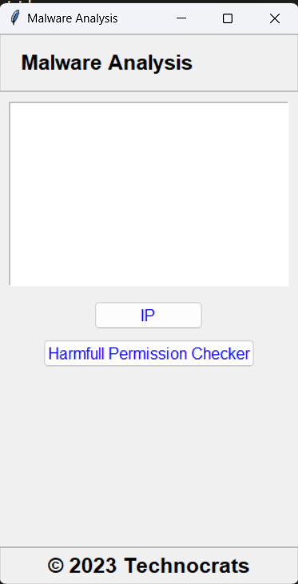

# Project Title

**Smart India Hackathon (SIH) 2023 - SecuriScan**

>Your mobile's first line of defense.

---

## Table of Contents

1. Project Description
2. Technologies Used
3. Features
4. Installation Guide
5. Usage
6. Screenshots

---

## Project Description

SecuriScan is a mobile security tool designed to enhance the protection of mobile devices by detecting malicious URLs and identifying harmful app permissions. It combines packet analysis and permission auditing to provide real-time threat detection, protecting users from phishing, malicious IPs, and overreaching app permissions. Using threat intelligence APIs and Scapy for packet sniffing, SecuriScan monitors network traffic for suspicious activity and flags potentially harmful app permissions with Android Debug Bridge (ADB). The tool's intuitive GUI, developed with Tkinter, provides users with alerts and live updates, making it accessible for non-technical users.

Aligned with the Smart India Hackathon's cybersecurity theme, SecuriScan addresses critical digital safety issues, ensuring that users' mobile devices remain secure from cyber threats. It promotes digital hygiene by raising awareness of risky permissions and offers a scalable solution to safeguard sensitive information. SecuriScan empowers users with real-time detection and proactive protection, contributing to India's growing focus on cybersecurity.

---

## Technologies Used

- **Frontend**: [tkinter, scapy]
- **Language**: [Python]

---

## Features

- **Packet Sniffing**
    - Monitors network traffic and detects suspicious IPs using Scapy and FraudGuard API integration.
    - Alerts users when a threat is identified.
    
- **Permission Checker**
    - Uses Android Debug Bridge (ADB) to list installed apps and their permissions.
    - Flags apps with potentially harmful permissions, such as access to SMS, camera, or device credentials.
    
- **Integrated GUI**
     - Developed with Tkinter for a seamless experience.
    - Includes live threat updates, alerts, and permission audit results.

- **Cross-Network Compatibility**
    - Works on mobile devices connected to laptops via USB tethering, sharing the same network.

---

## Installation Guide

### Prerequisites

- **Software Requirements**:

    - Python 2.7 or above
    
- **System Requirements**:
    - Android Mobile with developer options (on).
    - usb cable (For connection of mobile and laptop/computer).

### Steps to Install

1. Clone the repository:
    
    bash
    
    `git clone https://github.com/TrivediAarsh51/SecuriScan.git`

1. Navigate to the project directory:
    
    bash
      
    `cd SecuriScan`

3.  Run the application:
    
    bash        
    
    `python main.py`
    

---

## Usage

- **Step 1**:  Connect the device with the laptop using usb cable.
- **Step 2**: Turn on the Developer Options on the Android device.
- **Step 3**: Turn on the usb tethering from developer options.
- **Step 4:** Run the main.py file.

---

## Screenshots

![[Pasted image 20241120213357.png]]

